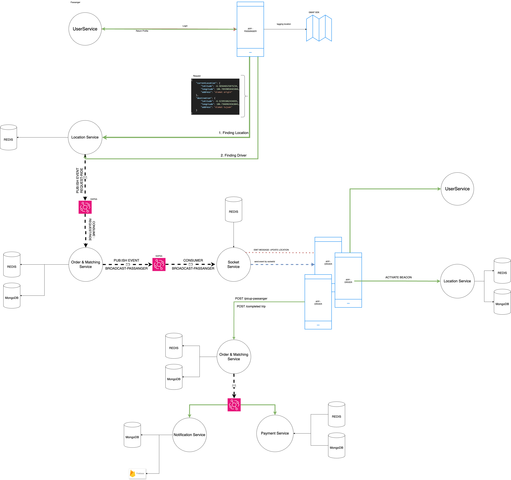

# Payment Service
This project written in Golang using ECHO framework based on a clean architecture that represents DDD and CQRS patterns. 

[](https://sonarcloud.io/summary/new_code?id=nebengjek_location-service)
[](https://sonarcloud.io/summary/new_code?id=nebengjek_location-service)
[](https://sonarcloud.io/summary/new_code?id=nebengjek_location-service)

## Running the project

- Make sure you have docker installed.
- Copy `.env.example` to `.env`
- Run `make run`.
- Go to `localhost:8088` to verify if the API server works.

## Swagger Docs

To create swagger api documentation you just have to run `make docs`.    
after the command executed successfully, run the app and open `http://localhost:8088/docs/index.html` to see swagger documentation page.


## Commands

| Command                                  | Description                                                 |
|------------------------------------------|-------------------------------------------------------------|
| `make run`                               | Start DEV REST API application                              |
| `make start`                             | Start REST API application                                  |

## Folder Structure

```
.
├── bin         
   ├── app
   ├── config            # configuration of env
   ├── middlewares        # Auth middleware
   └── modules          # Core module, includes apis: users, orgs        # Thirdparty configs
   └── pkg          # helpers

```

## NEBENGJEK
### Description
NebengJek is a ride-sharing app that connects users with shared rides, system is very lite, simple,
and fast. Users can either be Riders, requesting a ride, or Drivers, offering their vehicle. 
Both can choose whom to ride with, as long as they're within a specific area.

### Architecture

### System Flow



### DFD

## Open Source Refs
- https://cuelang.org/docs/about/
- https://www.openpolicyagent.org/docs/latest/
- https://echo.labstack.com/guide/
- https://firebase.google.com/docs/auth/admin/
- https://pkg.go.dev/firebase.google.com/go/auth

## AUTHOR
- Farid Tri Wicaksono [https://github.com/farid-alfernass]